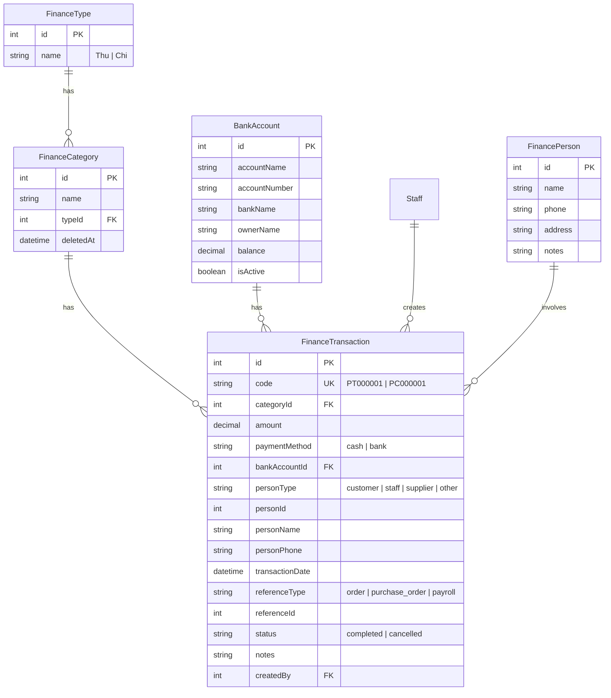
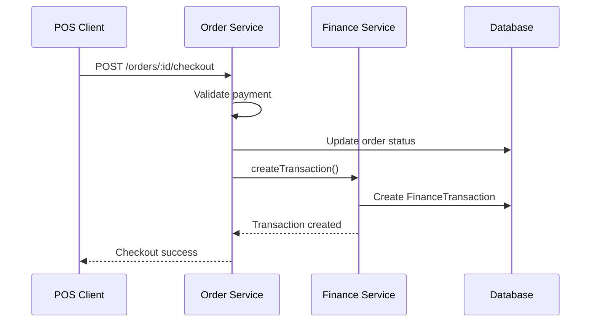
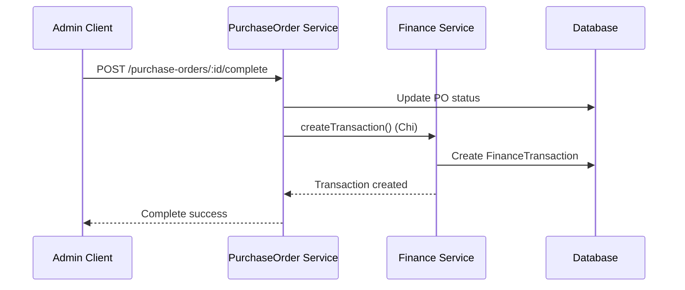

# Finance Module (Sổ Quỹ) - Business Logic Documentation

## Tổng quan

Module Sổ Quỹ quản lý các giao dịch thu/chi tiền mặt và ngân hàng của quán cà phê. Module này tích hợp với các module khác như Đơn hàng, Nhập hàng, và Bảng lương để tự động ghi nhận các giao dịch tài chính.

---

## Entities và Relationships



---

## Business Rules

### 1. Mã phiếu (Transaction Code)

| Loại | Prefix | Format | Ví dụ |
|------|--------|--------|-------|
| Phiếu Thu | PT | PT + 6 số | PT000001, PT000002 |
| Phiếu Chi | PC | PC + 6 số | PC000001, PC000002 |

- Mã phiếu được tạo tự động, tăng dần trong mỗi loại
- Unique constraint đảm bảo không trùng lặp

### 2. Loại thu/chi (Categories)

**Thu (typeId = 1)**:
- Tiền khách trả
- Thu nợ
- Vay
- Đầu tư
- Thu khác

**Chi (typeId = 2)**:
- Tiền trả NCC
- Tiền lương
- Điện nước
- Tiền thuê mặt bằng
- Trả nợ
- Chi khác

### 3. Phương thức thanh toán

| Phương thức | Yêu cầu |
|-------------|---------|
| `cash` (Tiền mặt) | Không cần thông tin bổ sung |
| `bank` (Ngân hàng) | **Bắt buộc** phải chọn `bankAccountId` |

### 4. Người nộp/nhận (Person)

| personType | Nguồn dữ liệu |
|------------|---------------|
| `customer` | Bảng `Customer` |
| `staff` | Bảng `Staff` |
| `supplier` | Bảng `Supplier` |
| `other` | Bảng `FinancePerson` |

- `personId`: ID từ bảng tương ứng
- `personName`, `personPhone`: Lưu snapshot để hiển thị

### 5. Cập nhật phiếu (Update Rules)

| Trường | Phiếu tự lập | Phiếu liên kết (từ module khác) |
|--------|--------------|----------------------------------|
| `notes` | ✅ Cho phép | ✅ Cho phép |
| `transactionDate` | ✅ Cho phép | ✅ Cho phép |
| `amount` | ✅ Cho phép | ❌ Không cho phép |
| `categoryId` | ✅ Cho phép | ❌ Không cho phép |
| `status` | ❌ Chỉ qua API Cancel | ❌ Chỉ qua API Cancel |

> **Lý do**: Phiếu liên kết từ module khác (Order, PurchaseOrder, Payroll) phải giữ nguyên số tiền và loại để đảm bảo tính nhất quán dữ liệu.

### 6. Trạng thái phiếu (Status)

| Status | Mô tả |
|--------|-------|
| `completed` | Giao dịch hoàn thành |
| `cancelled` | Giao dịch đã hủy |

- Phiếu đã hủy **không thể** cập nhật
- Hủy phiếu thực hiện qua API DELETE (soft delete via status)

### 7. Liên kết module (Reference)

| referenceType | Từ module | Khi nào tạo phiếu |
|---------------|-----------|-------------------|
| `order` | Đơn hàng | Khi checkout thành công |
| `purchase_order` | Nhập hàng | Khi hoàn thành đơn nhập |
| `payroll` | Bảng lương | Khi thực hiện thanh toán lương |

---

## Thống kê (Statistics)

### Công thức tính

```
Tồn quỹ = Quỹ đầu kỳ + Tổng thu - Tổng chi
```

| Chỉ số | Mô tả |
|--------|-------|
| `openingBalance` | Tổng (Thu - Chi) của tất cả giao dịch **trước** `dateFrom` |
| `totalIncome` | Tổng thu trong kỳ [dateFrom, dateTo] |
| `totalExpense` | Tổng chi trong kỳ [dateFrom, dateTo] |
| `closingBalance` | openingBalance + totalIncome - totalExpense |

### Filter thống kê

- `dateFrom`, `dateTo`: Khoảng thời gian tính
- `paymentMethod`: Lọc theo phương thức thanh toán (cash/bank)
- Chỉ tính phiếu có `status = 'completed'`

---

## API Endpoints

### Transactions

| Method | Endpoint | Mô tả | Permission |
|--------|----------|-------|------------|
| GET | `/finance/transactions` | Danh sách giao dịch **(bao gồm stats)** | `finance:view` |
| GET | `/finance/transactions/:id` | Chi tiết giao dịch | `finance:view` |
| POST | `/finance/transactions` | Tạo phiếu thu/chi | `finance:create` |
| PATCH | `/finance/transactions/:id` | Cập nhật phiếu | `finance:update` |
| DELETE | `/finance/transactions/:id` | Hủy phiếu | `finance:delete` |
| GET | `/finance/export` | Xuất Excel | `finance:view` |

### Categories

| Method | Endpoint | Mô tả | Permission |
|--------|----------|-------|------------|
| GET | `/finance/categories` | Danh sách loại thu/chi | `finance:view` |
| POST | `/finance/categories` | Tạo loại mới | `finance:create` |
| PATCH | `/finance/categories/:id` | Cập nhật loại | `finance:update` |
| DELETE | `/finance/categories/:id` | Xóa loại | `finance:delete` |

### Bank Accounts

| Method | Endpoint | Mô tả | Permission |
|--------|----------|-------|------------|
| GET | `/finance/bank-accounts` | Danh sách tài khoản | `finance:view` |
| POST | `/finance/bank-accounts` | Tạo tài khoản | `finance:create` |
| PATCH | `/finance/bank-accounts/:id` | Cập nhật tài khoản | `finance:update` |
| DELETE | `/finance/bank-accounts/:id` | Xóa tài khoản | `finance:delete` |

### Finance Persons

| Method | Endpoint | Mô tả | Permission |
|--------|----------|-------|------------|
| GET | `/finance/persons` | Danh sách người nộp/nhận | `finance:view` |
| POST | `/finance/persons` | Tạo người mới | `finance:create` |
| PATCH | `/finance/persons/:id` | Cập nhật thông tin | `finance:update` |
| DELETE | `/finance/persons/:id` | Xóa người | `finance:delete` |

---

## Query Parameters

### GET /finance/transactions

| Param | Type | Mô tả |
|-------|------|-------|
| `page` | number | Trang hiện tại (default: 1) |
| `limit` | number | Số bản ghi/trang (default: 20) |
| `search` | string | Tìm theo mã, ghi chú, tên người, SĐT |
| `typeId` | number | 1 = Thu, 2 = Chi |
| `categoryIds` | number[] | Lọc theo nhiều loại thu/chi |
| `paymentMethod` | string | `cash` hoặc `bank` |
| `status` | string | `completed` hoặc `cancelled` |
| `creatorIds` | number[] | Lọc theo người tạo |
| `dateFrom` | string | Từ ngày (YYYY-MM-DD) |
| `dateTo` | string | Đến ngày (YYYY-MM-DD) |
| `sort` | object | Sắp xếp, VD: `{transactionDate: 'DESC'}` |

---

## Integration Flow

### Order Checkout → Finance Transaction



### Purchase Order Payment → Finance Transaction



---

## Validation Rules

### CreateFinanceTransactionDto

| Field | Required | Validation |
|-------|----------|------------|
| `categoryId` | ✅ | Phải tồn tại trong FinanceCategory |
| `amount` | ✅ | > 0 |
| `paymentMethod` | ✅ | `cash` hoặc `bank` |
| `bankAccountId` | Conditional | Bắt buộc nếu `paymentMethod = 'bank'` |
| `personType` | ❌ | `customer`, `staff`, `supplier`, `other` |
| `transactionDate` | ❌ | ISO date string |

### CreateBankAccountDto

| Field | Required | Validation |
|-------|----------|------------|
| `accountName` | ✅ | String |
| `accountNumber` | ✅ | String, unique |
| `bankName` | ✅ | String |
| `ownerName` | ✅ | String |

---

## Error Codes

| Error | Mô tả |
|-------|-------|
| `Loại thu/chi không tồn tại` | categoryId không hợp lệ |
| `Vui lòng chọn tài khoản ngân hàng` | paymentMethod=bank nhưng thiếu bankAccountId |
| `Không thể cập nhật phiếu đã hủy` | Cố update phiếu có status=cancelled |
| `Không thể thay đổi số tiền hoặc loại thu/chi của phiếu liên kết` | Cố thay đổi amount/categoryId của phiếu có referenceType |
| `Không thể xóa loại thu/chi đang được sử dụng` | Category đang có transaction |
| `Số tài khoản đã tồn tại` | accountNumber trùng |
